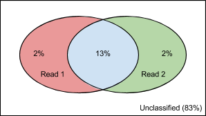

# RADSeq Pipeline: User Guide

Documentation that describes the steps required to process a RADSeq data set from 
RAW data to a form useful for biological analysis.

## Overview

The main steps to process a dataset are:

1. Data structure setup
2. Kraken to remove contaminants (if contamination is present)
  a. Run kraken on each raw data file (read 1 and 2 separately)
  b. Run seq-sets on kraken results to remove contaminants on from raw files
3. Pear to merge overlapping reads
4. Demultiplex individuals
5. Optimise denovo_map parameters


## Glossary

* **Raw** (sequence, files): the sequences or files as they came off the MiSeq/HiSeq
* **Demux**: short for ‘demultiplex’ (shorthand from electronics field :P)

## Data structure setup

The radseq pipeline expects a specific data structure.  You should create one directory 
for each experiment you complete (i.e. each dataset to come off the MiSeq).  Inside this 
directory you will have one directory for each step in the pipeline.  The pipeline 
includes a script to create the required directory structure however this is what it 
will look like.

* 2014-12-01_lobster/
  * 00-raw/
  * 01-kraken/
  * 02-filtered/
  * 03-paired/
  * 04-demux/
  * 05-denovo_opt/
  * …
* process.log
* slurm.conf
* 2014-12-09_abalone/
  * …

```
module load rad-pipeline

# make a directory for your project (and subdirectories for each step)
rad-pipeline_make_rad_experiment YOUR-PROJECT-NAME
cd YOUR-PROJECT-NAME

# copy files for into your project structure
# NOTE: you can use a symbolic link instead of copying if your files are saved 
# somewhere else (and won’t change)
cp RAW-SEQ-FILES 00-raw/
```
**Figure**: Commands used to setup the directory structure ready for RADSeq analysis.  
Replace YOUR-PROJECT-NAME with the actual name of your project AND RAW-SEQ-FILES with 
the path to your fastq files given to you by the MiSeq.

### process.log file

When you run the command “rad-pipeline_make_rad_experiment" a file will be created in the experiment 
directory called “process.log".  Inside this file will be one line with the current date/time 
and a message saying “Create Experiment: XXX".

Every time you run one the rad-pipeline_make_* commands a line will be added to this file with details 
of what command was used (and the date/time).  This will only happen if the process.log 
file exists; if you delete it then no logging will happen.

NOTE: because BASH performs some “magic" on the command before giving it to the rad-pipeline_make_* 
command, the command printed here may not exactly match what you typed but it should work 
in MOST cases.  The main case where it will get the command wrong is when you list files 
with a * (i.e. ../00-raw/*.fq) instead of just a directory (i.e. ../00-raw) to look in.

### slurm.conf file

When you run the command “rad-pipeline_make_rad_experiment" a file will be created in the experiment 
directory called “slurm.conf".  Initially this file is blank however if you add anything 
to it then this will be added to slurm scripts that are generated by the rad-pipeline_make_* commands 
immediately after the #SBATCH lines.  You can use this to add additional slurm configuration 
or custom commands to every job.

```
#SBATCH --mail-type=ALL
#SBATCH --mail-user=YOU@EMAIL.ADDRESS
```
**Figure**: slurm.conf example that instructs slurm to email you when you job starts and 
finishes (or errors)

## FastQC

FastQC is used to get a summary of the quality of your sequences.  This can be done at 
any step along the pipeline that you choose; just change the target directory to suit.

NOTE: The FastQC results will be placed in the directory you run sbatch from.  This can 
be a separate directory (e.g. 00-raw-fastqc), a subdirectory (e.g. 00-raw/fastqc) or with 
the target sequence files (e.g. 00-raw).  The first or second option is recommended.

```
module load rad-pipeline

# make the directory to store fastqc results
# See note above figure regarding the place to store fastqc results
mkdir -p OUTPUT_DIR

# move to the directory
cd OUTPUT_DIR

# make the slurm script
# Note: rad-pipeline_make_fastqc has other options (e.g. # of cores to use) 
# see -h for details
# when in 00-raw-fastqc/
rad-pipeline_make_fastqc_job ../00-raw > run_fastqc

# when in 00-raw/fastqc/
rad-pipeline_make_fastqc_job .. > run_fastqc

# run job
sbatch run_fastqc

cd ..
```
**Figure**: Commands used to run FastQC.  OUTPUT_DIR is a directory of your choosing, 
see note above figure.


Afterwards, your output directory should contain a directory for each sample which contains 
the fastqc results.  Note: it deletes the .zip file since it is just a compressed version 
of the files in the directory.

## Contaminant removal

Contaminant removal is performed in two steps; first the contaminants are identified using 
kraken and later they are removed from the raw sequences with seq-sets.

NOTE: kraken has an error rate at 1.5% so if your contamination is less than this then don’t 
bother to remove it.

### Kraken (identification)

The meta genomic sequence identification tool called kraken is used

```
module load rad-pipeline

# move to the kraken step directory
cd 01-kraken

# make the slurm script
# note: rad-pipeline_make_kraken_job has other parameters to alter how it works (see -h opt)
# e.g. to search for .fq files instead of .fastq etc.
rad-pipeline_make_kraken_job ../00-raw > run_kraken
# For gzipped files use below instead:
rad-pipeline_make_kraken_job -f "*.f*q*" ../00-raw > run_kraken
# To kraken gz files you will need to nano into the run_kraken script and add --gzip-compressed option (type gz option before --preload)

# run job
sbatch run_kraken

cd ..
```
**Figure**: Commands used to run kraken

Afterwards, your 01-kraken directory should contain 3 files per raw file; classified & unclassified Fastq files as well as a classification (output) file.  There will also be the slurm-XXXX.out file which contains the percentage of contaminant sequences (i.e. ‘classified’ as bacterial) for each sample.

### Seq-sets (removal)

The general purpose utility called seq-sets is used to remove the contaminated sequences from the raw data.  It calculates the union of the classified read 1 and read 2 files from kraken and outputs any of the raw sequences that are NOT present in the union.  See Venn diagram below.


**Figure**: venn diagram showing the classification of read 1 and read 2.  Seq-sets keeps only sequences NOT in the UNION of read1 and read2 classified.  i.e. 83% unclassified reads in this example.

```
module load rad-pipeline

# move to the filtered step directory
cd 02-filtered

# make the slurm script
# Note: run rad-pipeline_make_seq-sets_job -h to see other options
rad-pipeline_make_seq-sets_job -k ../01-kraken -- ../00-raw > run_seq-sets
# If sequence files in 00-raw directory are gzipped use:
rad-pipeline_make_seq-sets_job -k ../01-kraken -f \*.fastq.gz -- ../00-raw > run_seq-sets
# NOTE: -- flag means no more flags will appear after this. Hence all additional options need to go before the -- flag.


# run job
sbatch run_seq-sets

cd ..
```
**Figure**: Commands used to run raw sequence filtering

Afterwards, your 02-filtered directory should contain 1 fastq file per raw fastq file, the run_seq-sets script and the slurm-XXXX.out file.  The slurm-XXXX.out file contains lots of useful information about how the filtering went including the percentage of sequences that were removed from each file.

NOTE: if the amount filtered is less that 1.5% then you should NOT use the filtered results in the next step.  Instead, you should just use the raw sequences.

## Merge overlapping pairs (pear)

The Pear tool is used to merge overlapping paired-end sequences.  This will only be useful if your insert size is smaller than 2x read length.

```
module load rad-pipeline

# move to the paired step directory
cd 03-paired

# make the slurm script
# NOTE: if your sample has low contaminants then use '00-raw' directory instead
rad-pipeline_make_pear_job ../02-filtered > run_pear

# you may want to add settings in run_pear.  Use the OPTS="" line to add them.

# run job
sbatch run_pear

cd ..
```
**Figure**: Commands used to run pear

Your 03-paired directory should contain 5 fastq files per pair of input fastq files; assembled, discarded, unassembled forward, unassembled reverse and mergeforward (which contains the contents of assembled and unassembled forward files).  The slurm-XXXX.out file will contain the number of sequences that were merged.

## Demultiplex RadTags

Uses stacks process_radtags program to demultiplex sequences for each radtag followed by a cleanup.  Note: the cleanup is included in the demultiplex script now.

```
module load rad-pipeline

# move to the filtered raw step directory
cd 04-demux

# make the slurm script (use one of the following depending on your needs)
# NOTE: this script will automatically detect and handle gzipped or plain files
# for paired data (filtered or not)
rad-pipeline_make_demux_job -f "*mergeforward.f*q*" ../03-paired > run_demux

# for filtered (unpaired) data
rad-pipeline_make_demux_job ../02-filtered > run_demux

# OR for raw (unpaired) data.\
rad-pipeline_make_demux_job ../00-raw > run_demux

# you may want to edit settings in run_demux

# run job (either with slurm OR interactively)
sbatch run_demux
# OR (NOTE: the tee command will save the output to file as well as on-screen)
./run_demux 2>&1 | tee >(grep -v "Processing RAD-Tag" >> summary.out)

cd ..
```
**Figure**: Commands used to run demultiplex and clean up radtags

Afterwards, your 04-demux directory will have 1 fastq (.fq) file per radtag that contained 
data.  There will also be two fastq files containing the discarded sequences (i.e. low 
quality, bad radtag etc.) and three summary files; process_radtags.log, the output from 
process_radtags command, samples.count, the number of reads and barcode used in each sample 
and summary.out (or slurm-XXXXX.out), the overall output including the barcode to RADXX 
mapping.


## Optimising denovo_map.pl

[NOTE: this section not fully tested, please report any issues you get]

Selecting parameters for denovo_map.pl is very much a ‘trial and error’ affair so we have 
developed a tool to help execute this process and give you a summary at the end.  
Optimisation occurs it two phases; the first, a coarse grained trial over a wide range of 
values followed by a more focused fine-grained examination.

### Phase 1: Coarse grained

Select a wide range of values to try.  The tool will automatically select a number of 
midpoints between this range to try.  Be careful with the range as some values will take 
a very long time to run (e.g. -M beyond 15-20 will get orders of magnitude slower)

```
module load rad-pipeline

# move to the filtered raw step directory
cd 05-denovo_opt

# make a representative set of your samples
# select 2 to 6 files
mkdir test_samples
cd test_samples
ln -s /path_to_your/file1 .
ln -s /path_to_your/file2 .
ln -s /path_to_your/fileX .
cd ..

# make the slurm script
# NOTE: to alter the ranges of values add arguments to rad-pipeline_make_denovo_opt1_job
# run rad-pipeline_make_denovo_opt1_job -h to see what is available
rad-pipeline_make_denovo_opt1_job test_samples > run_denovo_opt1

# you may want to edit settings in run_process_radtags
# only edit the DENOVO_OPTS section.  The other settings
# should be changed via parameters on rad-pipeline_make_denovo_opt1 command.

# run job
sbatch run_denovo_opt1

cd ..
```
**Figure**: Commands used to run denovo optimise phase 1

Afterwards there will be a new file called ‘stats-phase1.tsv’ which is a tab delimited file 
with a summary of each run.  The columns in this file contain values extracted from the 
denovo_map.log file for that run.  If you asked rad-pipeline_make_denovo_opt1 to keep the denovo_map.log 
files then there will also be a directory called called denovolog which contains each logfile.

### Phase 2: Fine grained

In this phase we perform similar trials as phase 1 except we focus in on a particular target 
and try each number beside.  By default, it will try 2 numbers +- the target (i.e. 5 numbers 
for each parameter in total)

```
module load rad-pipeline

# move to the filtered raw step directory
cd 05-denovo_opt

# This step assumes you created links to representative set of your samples in
# phase 1.  If not, create them like above.

# make the slurm script
# NOTE: to alter the ranges of values add arguments to rad-pipeline_make_denovo_opt2_job
# run rad-pipeline_make_denovo_opt2_job -h to see what is available
rad-pipeline_make_denovo_opt2_job -m X -n Y -M Z test_samples > run_denovo_opt2

# you may want to edit settings in run_process_radtags
# only edit the DENOVO_OPTS section.  The other settings
# should be changed via parameters on rad-pipeline_make_denovo_opt1 command.

# run job
sbatch run_denovo_opt2

cd ..
```
**Figure**: Commands used to run denovo optimise phase 2.  X, Y, and Z are values which were 
identified as best from phase 1 for params -m, -n and -M respectively

Afterwards there will be a new file called ‘stats-phase2.tsv’ which is a tab delimited file 
with a summary of each run.  The columns in this file contain values extracted from the 
denovo_map.log file for that run.  If you asked rad-pipeline_make_denovo_opt1 to keep the denovo_map.log 
files then there will also be a directory called called denovolog which contains each logfile.
